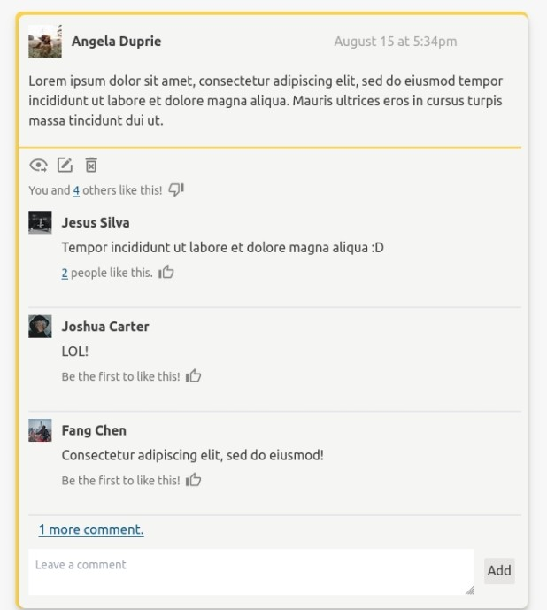
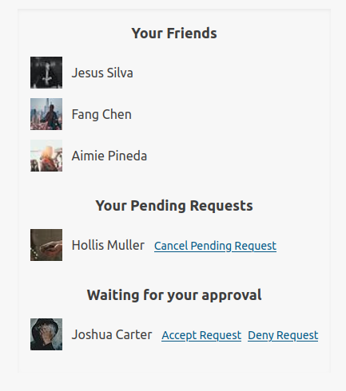
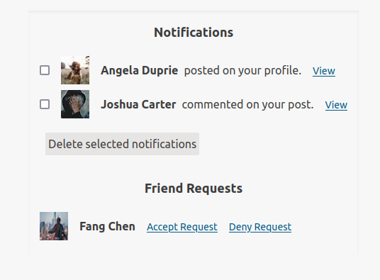

# People Pages

This is my final project for the Rails course over at [The Odin Project](https://www.theodinproject.com/lessons/ruby-on-rails-rails-final-project). The goal was to implement the core user functionality of Facebook: users, profiles, posts, news feed, "friending" and "liking". A project this feature-heavy could have consumed me for months but I was only able to allow four weeks, and a fifth week spent debugging. This is what I was able to complete in that time.

This project exhibits a full scale CRUD app with complex associations and database queries, and authentication.

#### Accessing The App

Check it out live: [People Pages](https://people-pages.herokuapp.com)

Authentication is required to access any part of this app. I welcome you to register as a new user, or reach out to me for the credentials of an existing test-user (whom has friends and activity to see) to view the full features of this application.

## Technologies Used
* Ruby 2.7.5
* Rails 7.0.3
* PostgreSQL
* Hotwire's Turbo
* Tailwind CSS
* [CSS Bundling Rails Gem](https://github.com/rails/cssbundling-rails)
* [Devise Gem](https://github.com/heartcombo/devise#getting-started)
* [OmniAuth Gem](https://github.com/omniauth/omniauth/tree/v2.1.1)
* Active Storage
* [Active Storage Validations Gem](https://github.com/igorkasyanchuk/active_storage_validations)
* [Bullet Gem](https://github.com/flyerhzm/bullet) (dev environment)

## Description

This is a basic social media application, perhaps similiar to what version 1.0 of Facebook may have offered. Some features include:

* Creating a profile: upload a photo, add basic information and social links.
* Privacy: user profiles are private to anyone who is not in their friends list.
* Make friends or find friends: browse all active users to request new friends, or search by name or email to find a user.
* News Feed: browse posts made by you or your friends.
* Personal posts: post directly to a friends profile page, which will be visible to all of their friends.
* Edit posts: updated posts keep original timestamp and indicate when they were updated.
* Comments: comment on posts
* Reactions: like/unlike a post or a comment made on a post.
* Notfications: alerts you when you recieve friend requests, new posts to your profile, a comment on your post, or a like to your post or comment.

#### Screenshots

  
  

## Setup/Installation

To run this project locally:

1. Clone this repository
2. Run `bundle install`
3. To install the CSS bundler, run `rails css:install:tailwind`
4. Run `rails server`

## Known Issues / Limitations

* Profile images disappear after 24 hours. They are currently only stored locally until I can continue troubleshooting the AWS S3 storage credentials issues.

* Submitting an empty post or comment will not prompt an error message. This goes for any other interactions with objects which have validations, due to being inside a Turbo Frame or Stream. My understanding is that at this stage Turbo cannot handle 422 response errors. I need time to implement an alternate solution. 

* Interacting with a Turbo frame after user session expires-- I use Devise to authenticate a user before any action is performed; if a session expires and a user clicks the "like" link, or any other link within a Turbo frame, a 401 response is triggered but I have not yet found a solution (within the scope of this project) to break out of the frame in order to properly redirect to the sign in page. 

* Confirmation to delete resources (posts, comments), although good practice, was not implemented. Turbo handles confirmations ("Are you sure?") and despite giving fair time to this issue, adding a turbo_confirm to a link consistently broke the link so that no request is sent.

* Lack of proper validations on model objects expose this app to problems if it were to be fiddled with. This was an area of struggle and I found the documentation on this to be lacking-- leading me to wonder if poor design on my part is the issue. For example, I haven't yet figured out how to successfully validate that a foreign key of some type exists (i.e -> validates :this_id || :this_other_id || :another_id).

### Reflections as a student: 

#### Newly acquired tools and technologies for this project:

* <b>Turbo</b>-- a component of the Hotwire technologies-- I put a lot of time into experimenting and understanding Frames and Streams, made difficult by the lack of documentation at this time for using these new tools. I am happy to see the fruit of this labor: posts and comments append or update beautifully within a stream and, all "friending" and "liking" functionality operates within a frame for efficient user management of these resources. I am not at all sure how scalable my approaches to these tools are, but i'm decently comfortable using them now.

* <b>Active Storage</b>-- I opted to learn how to use active storage to attach a profile image rather than Odin's recomendation of using a gravatar gem. Choosing Gravatar as the singuluar option for a profile image is limiting, exclusive, and simple to implement if ever I have the need. I chose to gain experience with this core module of Rails. I used the active_storage_validations gem to validate content type.

* <b>Optimization and Bullet</b>--  My first couple optimization sessions I made a good deal of difference by using my server logs to help me determine where to use eager loading. After that I began struggling to eliminate certain N + 1 query problems I was seeing. I decided to try Bullet, a gem designed to help identify these problems. I was happy to discover it also showed me some areas where i was eager loading unnecessarily. It's not a perfect tool, in some cases it would advise me to eager load then immediately advise me to remove the code it just suggested I add. But it was the quick solution I needed and did make a difference.

* <b>Tailwind CSS</b>-- I had recently become curious about this CSS framework, seeing it as a potentially handy tool for quick and minimal styling needs. I decided this project was a great opportunity to give it a go. I found it incredibly easy to get going with and nice to use.   

#### Additional Reflections

This being the largest Rails project I've built so far, I learned such a tremendous amount each week that I consistently wished I could go back and refactor my code from the week before, or even days before. In one or two cases I did entirely redesign the way I approached a problem as to not build off of such poor design; but most often I had to leave some redundancies, bulky logic-heavy controllers and maybe too much logic in my views as well. This will be a very fun redesign project some day.  

I feel questionable about how I handle the creation/deletion of notifications. I opted for using callback methods in the models of resources which are associated with notifications, but I can't determine if this is an appropriate use of callbacks. The outcome has exposed some redundancies, but I'm not sure if this is an issue with my implementation, or just poor design altogether.

A final note on Turbo. This is my first time experiencing the frustrations of using a new technology that doesn't have thorough documentation. I can see why Rails was quick to add Turbo as the default but it being the default adds complications for Rails newbies. I don't think I could overstate how much time I spent working out issues concering Turbo for this project, all the while having a feeling of wandering alone in a barren desert. I got through it and consequently leveled up my investigative skills, and acquired a newfound appreciation for well-documented technologies.

### What's Next

If I'm able to continue work on this project, the next version would ideally include:

* Functionality for commenting on comments
* More advanced posts-- allowing images, links, etc.
* Private messages between users
* Alerts for notifications
* More notifications, like when a friend request has been accepted.
* Additional features for profiles including being able to add more than one website or social link.
* The profile image will be "likable" and "comentable".
* OmniAuth for sign in with Facebook
* Mailers for welcome email and forgot password.
* Viewing "likes" and notifications will be pop out elements rather than seperate pages.
